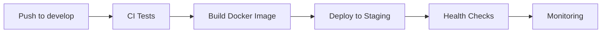
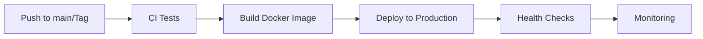

# 🚀 GitHub Actions Workflows - MaraBet AI

> **Pipeline Completo de CI/CD para Deploy Automático e Monitoramento Contínuo**

## 📋 Visão Geral

Este diretório contém todos os workflows do GitHub Actions para o MaraBet AI, implementando um pipeline completo de CI/CD com testes automatizados, build de imagens Docker e deploy automático em ambientes de Staging e Produção.

## 🏗️ Estrutura dos Workflows

### **Workflows Principais**

| Workflow | Arquivo | Descrição | Trigger |
|----------|---------|-----------|---------|
| **CI** | `ci.yml` | Testes automatizados e análise de código | Push/PR |
| **Docker Build** | `docker-build.yml` | Build e push de imagens Docker | Push/Tag |
| **Deploy Staging** | `deploy-staging.yml` | Deploy automático para Staging | develop |
| **Deploy Production** | `deploy-production.yml` | Deploy automático para Produção | main/tag |
| **Rollback** | `rollback.yml` | Rollback manual de deployments | Manual |
| **Cleanup** | `cleanup.yml` | Limpeza e manutenção automática | Schedule/Manual |
| **Monitoring** | `monitoring.yml` | Monitoramento e alertas | Schedule/Manual |

### **Arquivos de Configuração**

| Arquivo | Descrição |
|---------|-----------|
| `environments.yml` | Configurações de ambientes |
| `test-config.yml` | Configurações de testes |
| `docker-config.yml` | Configurações de Docker |
| `monitoring-config.yml` | Configurações de monitoramento |

## 🔄 Fluxo de Deploy

### **1. Desenvolvimento (Branch: develop)**


### **2. Produção (Branch: main ou Tags)**


## 🧪 Testes Automatizados

### **Tipos de Testes**

1. **Testes Unitários**
   - Cobertura mínima: 80%
   - Paralelização: 4 workers
   - Timeout: 60 segundos

2. **Testes de Integração**
   - APIs externas (mockadas)
   - Banco de dados
   - Timeout: 300 segundos

3. **Testes de Segurança**
   - Bandit (código Python)
   - Safety (dependências)
   - Trivy (imagens Docker)

4. **Testes de Performance**
   - Load testing
   - Stress testing
   - Métricas de resposta

### **Configuração de Testes**

```yaml
# Exemplo de configuração
test_config:
  python_version: "3.11"
  coverage_threshold: 80
  parallel_workers: 4
  timeout: 300
```

## 🐳 Build e Deploy Docker

### **Configurações de Build**

- **Plataformas**: linux/amd64, linux/arm64
- **Cache**: GitHub Actions cache
- **Tags**: Automáticas baseadas em branch/tag
- **Scan**: Trivy para vulnerabilidades

### **Configurações de Deploy**

- **Staging**: Deploy automático em develop
- **Production**: Deploy automático em main/tags
- **Health Checks**: Verificação automática pós-deploy
- **Rollback**: Disponível via workflow manual

## 📊 Monitoramento e Alertas

### **Health Checks**

- **Frequência**: A cada 5 minutos
- **Endpoints**: /health, /api/health, /dashboard
- **Timeout**: 30 segundos
- **Retries**: 3 tentativas

### **Métricas Monitoradas**

- **Sistema**: CPU, memória, disco, load average
- **Aplicação**: Response time, error rate, request rate
- **Banco de Dados**: Connection pool, query time, deadlocks

### **Alertas**

- **Slack**: Notificações em tempo real
- **Telegram**: Alertas críticos
- **Email**: Relatórios diários (opcional)

## 🔧 Configuração

### **Secrets Necessários**

#### **Docker Registry**
```
DOCKER_USERNAME
DOCKER_PASSWORD
```

#### **Staging Environment**
```
STAGING_HOST
STAGING_USERNAME
STAGING_SSH_KEY
STAGING_PORT
STAGING_DATABASE_URL
```

#### **Production Environment**
```
PRODUCTION_HOST
PRODUCTION_USERNAME
PRODUCTION_SSH_KEY
PRODUCTION_PORT
PRODUCTION_DATABASE_URL
```

#### **API Keys**
```
API_FOOTBALL_KEY
THE_ODDS_API_KEY
TELEGRAM_BOT_TOKEN
TELEGRAM_CHAT_ID
```

#### **Monitoring**
```
GRAFANA_ADMIN_PASSWORD
SLACK_WEBHOOK_URL
```

### **Variáveis de Ambiente**

#### **Staging**
```yaml
ENVIRONMENT: staging
LOG_LEVEL: INFO
CACHE_TTL: 300
```

#### **Production**
```yaml
ENVIRONMENT: production
LOG_LEVEL: WARNING
CACHE_TTL: 600
RATE_LIMIT_ENABLED: true
```

## 🚀 Como Usar

### **Deploy Automático**

1. **Para Staging**:
   ```bash
   git checkout develop
   git add .
   git commit -m "feat: nova funcionalidade"
   git push origin develop
   ```

2. **Para Produção**:
   ```bash
   git tag v1.0.0
   git push origin v1.0.0
   ```

### **Deploy Manual**

1. Acesse **Actions** no repositório
2. Selecione o workflow desejado
3. Clique em **Run workflow**
4. Escolha o ambiente e confirme

### **Rollback**

1. Acesse **Actions** > **Rollback Deployment**
2. Escolha o ambiente
3. Especifique a versão (opcional)
4. Execute o workflow

## 📈 Métricas e KPIs

### **Deploy Metrics**
- **Tempo de Deploy**: < 5 minutos
- **Taxa de Sucesso**: > 95%
- **Tempo de Rollback**: < 2 minutos

### **Performance Metrics**
- **Uptime**: > 99.9%
- **Response Time**: < 200ms
- **Error Rate**: < 0.1%

### **Quality Metrics**
- **Test Coverage**: > 80%
- **Security Score**: > 90%
- **Code Quality**: A+

## 🛠️ Troubleshooting

### **Problemas Comuns**

1. **Deploy Falha**
   - Verificar logs do workflow
   - Verificar conectividade SSH
   - Verificar recursos do servidor

2. **Health Check Falha**
   - Verificar se o container está rodando
   - Verificar configuração do nginx
   - Verificar logs da aplicação

3. **Testes Falham**
   - Verificar dependências
   - Verificar configuração do banco
   - Verificar conectividade de rede

### **Comandos Úteis**

```bash
# Ver logs do workflow
gh run view <run-id>

# Ver logs do container
docker logs marabet-ai-production

# Verificar status dos containers
docker ps -a

# Executar comandos no container
docker exec -it marabet-ai-production bash
```

## 📚 Recursos Adicionais

### **Documentação**
- [GitHub Actions](https://docs.github.com/en/actions)
- [Docker Compose](https://docs.docker.com/compose/)
- [Prometheus](https://prometheus.io/docs/)
- [Grafana](https://grafana.com/docs/)

### **Ferramentas**
- [Docker Hub](https://hub.docker.com/)
- [Trivy](https://trivy.dev/)
- [Bandit](https://bandit.readthedocs.io/)

---

**MaraBet AI: Pipeline de Deploy Profissional e Confiável!** 🚀💰
