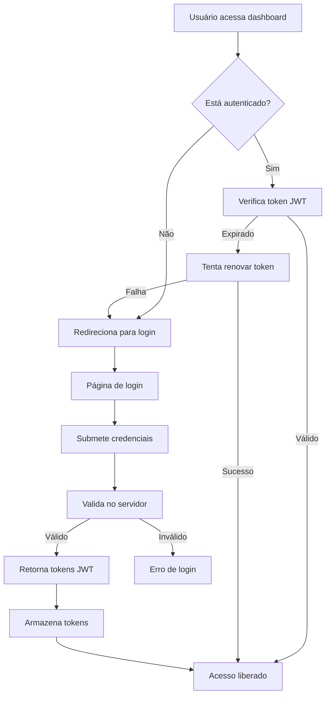

# 🔐 Guia de Autenticação e Usuários - MaraBet AI

> **Sistema completo de autenticação JWT com gerenciamento de usuários e permissões**

## 📋 Visão Geral

O MaraBet AI implementa um sistema robusto de autenticação JWT com gerenciamento completo de usuários, roles, permissões e sessões. O sistema é integrado ao dashboard FastAPI e protege todos os endpoints da API.

## 🏗️ Arquitetura do Sistema

### **Componentes Principais**

1. **Modelos de Usuário** - Estrutura de dados completa
2. **Autenticação JWT** - Tokens seguros e renovação automática
3. **Endpoints de Auth** - Login, registro, gerenciamento
4. **Dashboard Integrado** - Interface com autenticação
5. **Sistema de Roles** - Controle de acesso granular
6. **Sessões e Atividades** - Auditoria completa

### **Fluxo de Autenticação**



## 🔧 Configuração

### **1. Inicializar Banco de Dados**

```bash
# Inicializar tabelas de autenticação
python scripts/init_auth_db.py

# Criar usuários de teste
python scripts/init_auth_db.py --test-users
```

### **2. Usuários Padrão Criados**

| Username | Email | Senha | Role | Descrição |
|----------|-------|-------|------|-----------|
| `admin` | admin@marabet.ai | admin123 | ADMIN | Administrador do sistema |
| `demo` | demo@marabet.ai | demo123 | USER | Usuário de demonstração |
| `moderator1` | moderator1@marabet.ai | mod123 | MODERATOR | Moderador (se --test-users) |
| `user1` | user1@marabet.ai | user123 | USER | Usuário comum (se --test-users) |
| `viewer1` | viewer1@marabet.ai | view123 | VIEWER | Apenas visualização (se --test-users) |

### **3. Variáveis de Ambiente**

```bash
# Configurações de segurança
SECRET_KEY=marabet-secret-key-2024
JWT_SECRET_KEY=marabet-jwt-secret-2024

# Configurações de token
ACCESS_TOKEN_EXPIRE_MINUTES=30
REFRESH_TOKEN_EXPIRE_DAYS=7

# Configurações de banco
DATABASE_URL=sqlite:///data/sports_data.db
```

## 👥 Sistema de Usuários

### **Modelo de Usuário**

```python
class User:
    # Identificação
    id: int
    username: str (único)
    email: str (único)
    hashed_password: str
    
    # Perfil
    full_name: str
    phone: str
    country: str
    timezone: str
    language: str
    
    # Permissões
    role: UserRole (admin, moderator, user, viewer)
    status: UserStatus (active, inactive, suspended, pending)
    is_verified: bool
    is_superuser: bool
    
    # Configurações de apostas
    default_currency: str (AOA, USD, EUR, BRL)
    min_bet_amount: str
    max_bet_amount: str
    risk_tolerance: str (low, medium, high)
    
    # Notificações
    email_notifications: bool
    telegram_notifications: bool
    telegram_chat_id: str
    
    # Timestamps
    created_at: datetime
    updated_at: datetime
    last_login: datetime
```

### **Roles e Permissões**

#### **ADMIN (Administrador)**
- ✅ Acesso total ao sistema
- ✅ Gerenciar usuários
- ✅ Configurar sistema
- ✅ Acessar logs e auditoria
- ✅ Controlar coletor de dados

#### **MODERATOR (Moderador)**
- ✅ Visualizar dados
- ✅ Gerenciar predições
- ✅ Acessar relatórios
- ❌ Gerenciar usuários
- ❌ Configurar sistema

#### **USER (Usuário)**
- ✅ Visualizar dados
- ✅ Acessar predições
- ✅ Personalizar perfil
- ❌ Gerenciar outros usuários
- ❌ Acessar configurações

#### **VIEWER (Visualizador)**
- ✅ Visualizar dados básicos
- ❌ Acessar predições detalhadas
- ❌ Personalizar configurações
- ❌ Gerenciar dados

## 🔑 Sistema de Autenticação JWT

### **Tokens JWT**

#### **Access Token**
- **Duração**: 30 minutos
- **Conteúdo**: user_id, username, role, email, is_verified, is_superuser
- **Uso**: Autenticação em requisições API

#### **Refresh Token**
- **Duração**: 7 dias
- **Conteúdo**: user_id
- **Uso**: Renovação de access tokens

### **Fluxo de Tokens**

```python
# Login
POST /auth/login
{
    "username": "admin",
    "password": "admin123",
    "remember_me": false
}

# Resposta
{
    "access_token": "eyJ0eXAiOiJKV1QiLCJhbGciOiJIUzI1NiJ9...",
    "refresh_token": "eyJ0eXAiOiJKV1QiLCJhbGciOiJIUzI1NiJ9...",
    "token_type": "bearer",
    "expires_in": 1800
}

# Renovação
POST /auth/refresh
{
    "refresh_token": "eyJ0eXAiOiJKV1QiLCJhbGciOiJIUzI1NiJ9..."
}
```

## 🌐 Endpoints da API

### **Autenticação**

| Endpoint | Método | Descrição | Autenticação |
|----------|--------|-----------|--------------|
| `/auth/register` | POST | Registrar novo usuário | Não |
| `/auth/login` | POST | Fazer login | Não |
| `/auth/logout` | POST | Fazer logout | Sim |
| `/auth/refresh` | POST | Renovar token | Não |
| `/auth/me` | GET | Informações do usuário atual | Sim |

### **Gerenciamento de Usuários**

| Endpoint | Método | Descrição | Permissão |
|----------|--------|-----------|-----------|
| `/auth/users` | GET | Listar usuários | ADMIN |
| `/auth/users/{id}` | GET | Buscar usuário | ADMIN |
| `/auth/users/{id}` | PUT | Atualizar usuário | ADMIN |
| `/auth/users/{id}` | DELETE | Deletar usuário | ADMIN |

### **Perfil do Usuário**

| Endpoint | Método | Descrição | Autenticação |
|----------|--------|-----------|--------------|
| `/auth/me` | GET | Perfil atual | Sim |
| `/auth/me` | PUT | Atualizar perfil | Sim |
| `/auth/change-password` | POST | Alterar senha | Sim |
| `/auth/forgot-password` | POST | Solicitar reset | Não |
| `/auth/reset-password` | POST | Confirmar reset | Não |

### **Atividades e Sessões**

| Endpoint | Método | Descrição | Autenticação |
|----------|--------|-----------|--------------|
| `/auth/activities` | GET | Atividades do usuário | Sim |
| `/auth/sessions` | GET | Sessões ativas | Sim |
| `/auth/sessions/{id}` | DELETE | Revogar sessão | Sim |
| `/auth/sessions/revoke-all` | POST | Revogar todas | Sim |

## 🎨 Interface do Dashboard

### **Páginas de Autenticação**

#### **Login (`/login`)**
- Formulário de login com username/email
- Campo de senha com toggle de visibilidade
- Checkbox "Lembrar de mim"
- Link para registro e recuperação de senha
- Validação em tempo real

#### **Registro (`/register`)**
- Formulário completo de registro
- Validação de força da senha
- Configurações de perfil
- Aceite de termos e condições
- Redirecionamento automático após registro

### **Dashboard com Autenticação**

#### **Sidebar do Usuário**
- Informações do usuário logado
- Role e status
- Botões de perfil e logout
- Links para login/registro (se não autenticado)

#### **Proteção de Conteúdo**
- Conteúdo limitado para usuários não autenticados
- Funcionalidades completas para usuários autenticados
- Controle de acesso baseado em roles

## 🔒 Segurança

### **Medidas Implementadas**

1. **Senhas Criptografadas**
   - Hash bcrypt com salt
   - Validação de força da senha
   - Política de senhas seguras

2. **Tokens JWT Seguros**
   - Assinatura HMAC-SHA256
   - Expiração configurável
   - Renovação automática

3. **Sessões Gerenciadas**
   - Controle de sessões ativas
   - Revogação de sessões
   - Logout em todos os dispositivos

4. **Auditoria Completa**
   - Log de todas as atividades
   - Rastreamento de IP e User-Agent
   - Histórico de acessos

5. **Validação de Dados**
   - Sanitização de inputs
   - Validação de email
   - Verificação de unicidade

### **Configurações de Segurança**

```python
# Configurações recomendadas para produção
SECRET_KEY = "chave-super-secreta-2024"
JWT_SECRET_KEY = "jwt-chave-super-secreta-2024"
ACCESS_TOKEN_EXPIRE_MINUTES = 15  # Mais restritivo
REFRESH_TOKEN_EXPIRE_DAYS = 1     # Mais restritivo

# Configurações de senha
MIN_PASSWORD_LENGTH = 12
REQUIRE_SPECIAL_CHARS = True
REQUIRE_UPPERCASE = True
REQUIRE_NUMBERS = True
```

## 🚀 Como Usar

### **1. Inicializar Sistema**

```bash
# Instalar dependências
pip install -r requirements.txt

# Inicializar banco de dados
python scripts/init_auth_db.py

# Iniciar dashboard
python run_dashboard.py
```

### **2. Acessar Dashboard**

```bash
# Abrir no navegador
http://localhost:8000

# Fazer login
Username: admin
Password: admin123
```

### **3. Gerenciar Usuários**

```python
# Via API
import requests

# Login
response = requests.post('http://localhost:8000/auth/login', json={
    'username': 'admin',
    'password': 'admin123'
})

tokens = response.json()
headers = {'Authorization': f'Bearer {tokens["access_token"]}'}

# Listar usuários
users = requests.get('http://localhost:8000/auth/users', headers=headers)
```

### **4. Personalizar Configurações**

```python
# Atualizar perfil
profile_data = {
    'full_name': 'João Silva',
    'phone': '+244123456789',
    'country': 'AO',
    'default_currency': 'AOA',
    'risk_tolerance': 'high'
}

requests.put('http://localhost:8000/auth/me', 
             json=profile_data, headers=headers)
```

## 📊 Monitoramento

### **Logs de Atividade**

```python
# Buscar atividades do usuário
activities = requests.get('http://localhost:8000/auth/activities', headers=headers)

# Tipos de atividades registradas:
# - user_registered
# - user_login
# - user_logout
# - password_changed
# - profile_updated
# - session_revoked
```

### **Sessões Ativas**

```python
# Listar sessões ativas
sessions = requests.get('http://localhost:8000/auth/sessions', headers=headers)

# Revogar sessão específica
requests.delete('http://localhost:8000/auth/sessions/123', headers=headers)

# Revogar todas as sessões
requests.post('http://localhost:8000/auth/sessions/revoke-all', headers=headers)
```

## 🛠️ Desenvolvimento

### **Adicionar Novas Permissões**

```python
# 1. Definir nova role
class UserRole(Enum):
    # ... roles existentes
    ANALYST = "analyst"

# 2. Criar decorator de permissão
def require_analyst(current_user: dict = Depends(get_current_active_user)):
    if current_user["role"] not in ["admin", "moderator", "analyst"]:
        raise HTTPException(status_code=403, detail="Acesso negado")
    return current_user

# 3. Aplicar em endpoints
@app.get("/api/analysis")
async def get_analysis(current_user: dict = Depends(require_analyst)):
    # Endpoint protegido
    pass
```

### **Customizar Validações**

```python
# Validação personalizada de senha
def validate_custom_password(password: str) -> bool:
    # Suas regras personalizadas
    return len(password) >= 12 and "!" in password

# Aplicar em UserCreate
class UserCreate(UserBase):
    password: str
    
    @validator('password')
    def validate_password(cls, v):
        if not validate_custom_password(v):
            raise ValueError('Senha não atende aos critérios')
        return v
```

## 📚 Recursos Adicionais

### **Documentação da API**
- Swagger UI: `http://localhost:8000/docs`
- ReDoc: `http://localhost:8000/redoc`

### **Ferramentas de Teste**
```bash
# Testar endpoints
curl -X POST http://localhost:8000/auth/login \
  -H "Content-Type: application/json" \
  -d '{"username": "admin", "password": "admin123"}'

# Usar token em requisições
curl -X GET http://localhost:8000/auth/me \
  -H "Authorization: Bearer SEU_TOKEN_AQUI"
```

### **Integração com Frontend**

```javascript
// Exemplo de integração JavaScript
class AuthService {
    constructor() {
        this.baseURL = 'http://localhost:8000';
    }
    
    async login(username, password) {
        const response = await fetch(`${this.baseURL}/auth/login`, {
            method: 'POST',
            headers: { 'Content-Type': 'application/json' },
            body: JSON.stringify({ username, password })
        });
        
        if (response.ok) {
            const tokens = await response.json();
            localStorage.setItem('access_token', tokens.access_token);
            localStorage.setItem('refresh_token', tokens.refresh_token);
            return tokens;
        }
        throw new Error('Login failed');
    }
    
    async getCurrentUser() {
        const token = localStorage.getItem('access_token');
        const response = await fetch(`${this.baseURL}/auth/me`, {
            headers: { 'Authorization': `Bearer ${token}` }
        });
        
        if (response.ok) {
            return await response.json();
        }
        throw new Error('Failed to get user');
    }
}
```

---

## 🎉 **SISTEMA DE AUTENTICAÇÃO COMPLETO!**

**Status**: ✅ **PRONTO PARA PRODUÇÃO**

O MaraBet AI agora possui um sistema completo de autenticação JWT com gerenciamento de usuários, roles, permissões e auditoria, totalmente integrado ao dashboard FastAPI!

**🔐 Desenvolvido com ❤️ para segurança e usabilidade**
