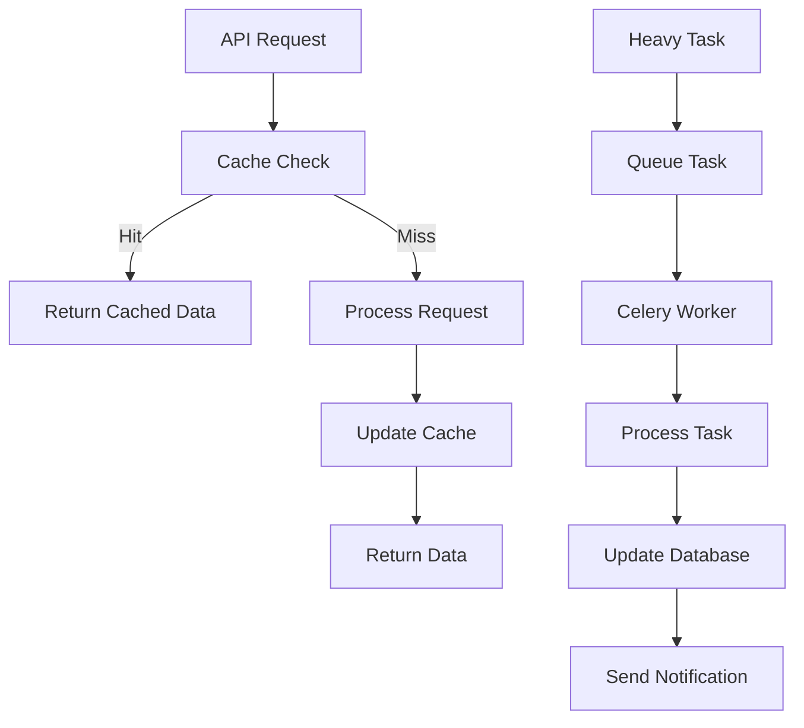

# 🚀 Guia de Cache Redis e Filas Celery - MaraBet AI

> **Sistema Avançado de Cache e Processamento Assíncrono para Máxima Performance**

## 📋 Visão Geral

O MaraBet AI implementa um sistema robusto de cache Redis e filas Celery para otimizar performance, processar tarefas pesadas de forma assíncrona e garantir escalabilidade do sistema.

## 🏗️ Arquitetura do Sistema

### **Componentes Principais**

1. **Redis Cache** - Armazenamento de dados de alta frequência
2. **Celery Workers** - Processamento assíncrono de tarefas
3. **Celery Beat** - Agendamento de tarefas
4. **Flower** - Monitoramento e gerenciamento
5. **Filas Especializadas** - Organização por tipo de tarefa

### **Fluxo de Dados**



## 🔧 Configuração do Redis

### **Configuração Básica**

```python
# cache/redis_cache.py
from cache.redis_cache import RedisCache

# Inicialização
cache = RedisCache(
    host='localhost',
    port=6379,
    db=0,
    password=None,
    max_connections=20
)
```

### **Configuração de Produção**

```yaml
# docker-compose.yml
redis:
  image: redis:7-alpine
  container_name: marabet-ai-redis
  ports:
    - "6379:6379"
  volumes:
    - redis_data:/data
    - ./redis/redis.conf:/usr/local/etc/redis/redis.conf
  command: redis-server /usr/local/etc/redis/redis.conf
```

### **Configurações de Performance**

```conf
# redis/redis.conf
maxmemory 512mb
maxmemory-policy allkeys-lru
save 900 1
save 300 10
save 60 10000
```

## 📊 Tipos de Cache

### **1. Cache de Odds (5 minutos)**
```python
# Armazenar odds
cache_odds('odds_12345_bet365', {
    'match_id': 12345,
    'home_odds': 2.10,
    'draw_odds': 3.40,
    'away_odds': 3.20,
    'bookmaker': 'bet365',
    'timestamp': datetime.now()
}, ttl=300)

# Recuperar odds
odds = get_odds('odds_12345_bet365')
```

### **2. Cache de Estatísticas (30 minutos)**
```python
# Armazenar estatísticas
cache_stats('stats_team_789', {
    'team_id': 789,
    'goals_scored': 45,
    'goals_conceded': 32,
    'form': 0.75,
    'updated_at': datetime.now()
}, ttl=1800)

# Recuperar estatísticas
stats = get_stats('stats_team_789')
```

### **3. Cache de Previsões (10 minutos)**
```python
# Armazenar previsões
cache_predictions('prediction_12345_ensemble', {
    'match_id': 12345,
    'prediction': 1,
    'confidence': 0.85,
    'model_type': 'ensemble',
    'created_at': datetime.now()
}, ttl=600)

# Recuperar previsões
prediction = get_predictions('prediction_12345_ensemble')
```

### **4. Cache de Dados Estáticos (24 horas)**
```python
# Ligas, times, competições
cache.set('leagues', 'all_leagues', leagues_data, ttl=86400)
cache.set('teams', 'team_789', team_data, ttl=86400)
```

## 🔄 Sistema de Filas Celery

### **Filas Especializadas**

| Fila | Propósito | Concorrência | Prioridade |
|------|-----------|--------------|------------|
| `ml_queue` | Machine Learning | 2 workers | Alta |
| `backtesting_queue` | Backtesting | 1 worker | Média |
| `data_queue` | Coleta de Dados | 3 workers | Alta |
| `notification_queue` | Notificações | 2 workers | Baixa |
| `maintenance_queue` | Manutenção | 1 worker | Baixa |

### **Configuração dos Workers**

```python
# tasks/celery_app.py
celery_app.conf.update(
    task_routes={
        'tasks.ml_tasks.*': {'queue': 'ml_queue'},
        'tasks.backtesting_tasks.*': {'queue': 'backtesting_queue'},
        'tasks.data_collection_tasks.*': {'queue': 'data_queue'},
        'tasks.notification_tasks.*': {'queue': 'notification_queue'},
        'tasks.maintenance_tasks.*': {'queue': 'maintenance_queue'},
    }
)
```

## 🧪 Tarefas Implementadas

### **1. Machine Learning Tasks**

#### **Treinamento de Modelos**
```python
# Treinar modelo específico
from tasks.ml_tasks import train_model

result = train_model.delay(
    model_type='random_forest',
    league_id=39,
    features=['home_goals_avg', 'away_goals_avg'],
    target='result'
)
```

#### **Predição de Partidas**
```python
# Fazer predição
from tasks.ml_tasks import predict_match

result = predict_match.delay(
    match_id=12345,
    model_type='ensemble'
)
```

#### **Treinamento Automático**
```python
# Treinar todos os modelos
from tasks.ml_tasks import train_all_models

result = train_all_models.delay()
```

### **2. Backtesting Tasks**

#### **Backtesting de Estratégia**
```python
# Executar backtesting
from tasks.backtesting_tasks import run_backtesting

result = run_backtesting.delay(
    strategy_name='value_betting',
    league_id=39,
    start_date='2024-01-01',
    end_date='2024-03-31',
    initial_capital=10000.0,
    bet_size=0.02
)
```

#### **Comparação de Estratégias**
```python
# Comparar estratégias
from tasks.backtesting_tasks import compare_strategies

result = compare_strategies.delay(
    league_id=39,
    start_date='2024-01-01',
    end_date='2024-03-31'
)
```

### **3. Data Collection Tasks**

#### **Coleta de Odds**
```python
# Coletar odds
from tasks.data_collection_tasks import collect_odds_data

result = collect_odds_data.delay()
```

#### **Coleta de Estatísticas**
```python
# Coletar estatísticas
from tasks.data_collection_tasks import collect_stats_data

result = collect_stats_data.delay()
```

#### **Dados ao Vivo**
```python
# Coletar dados ao vivo
from tasks.data_collection_tasks import collect_live_data

result = collect_live_data.delay()
```

### **4. Notification Tasks**

#### **Alertas de Value Bet**
```python
# Enviar alerta
from tasks.notification_tasks import send_value_bet_alert

result = send_value_bet_alert.delay({
    'match_id': 12345,
    'home_team': 'Manchester United',
    'away_team': 'Liverpool',
    'bet_type': 'home_win',
    'odds': 2.10,
    'value': 0.15
})
```

#### **Relatórios Semanais**
```python
# Enviar relatório
from tasks.notification_tasks import send_weekly_report

result = send_weekly_report.delay()
```

### **5. Maintenance Tasks**

#### **Limpeza de Cache**
```python
# Limpar cache
from tasks.maintenance_tasks import cleanup_cache

result = cleanup_cache.delay()
```

#### **Otimização do Banco**
```python
# Otimizar banco
from tasks.maintenance_tasks import optimize_database

result = optimize_database.delay()
```

#### **Backup do Banco**
```python
# Fazer backup
from tasks.maintenance_tasks import backup_database

result = backup_database.delay()
```

## ⏰ Agendamento de Tarefas

### **Tarefas Automáticas**

```python
# tasks/celery_app.py
beat_schedule={
    # Treinamento diário às 2:00 AM
    'train-models-daily': {
        'task': 'tasks.ml_tasks.train_all_models',
        'schedule': crontab(hour=2, minute=0),
        'options': {'queue': 'ml_queue'}
    },
    
    # Coleta de odds a cada 15 minutos
    'collect-odds-data': {
        'task': 'tasks.data_collection_tasks.collect_odds_data',
        'schedule': crontab(minute='*/15'),
        'options': {'queue': 'data_queue'}
    },
    
    # Backtesting semanal às segundas 3:00 AM
    'weekly-backtesting': {
        'task': 'tasks.backtesting_tasks.run_weekly_backtesting',
        'schedule': crontab(hour=3, minute=0, day_of_week=1),
        'options': {'queue': 'backtesting_queue'}
    },
    
    # Limpeza diária às 1:00 AM
    'cleanup-cache': {
        'task': 'tasks.maintenance_tasks.cleanup_cache',
        'schedule': crontab(hour=1, minute=0),
        'options': {'queue': 'maintenance_queue'}
    }
}
```

## 🚀 Como Usar

### **1. Iniciar o Sistema**

```bash
# Iniciar todos os serviços
docker-compose up -d

# Verificar status
docker-compose ps
```

### **2. Gerenciar Workers**

```bash
# Iniciar worker específico
python scripts/celery_manager.py start-worker ml_queue 2 info

# Iniciar scheduler
python scripts/celery_manager.py start-beat

# Iniciar monitoramento
python scripts/celery_manager.py start-flower 5555
```

### **3. Monitorar Tarefas**

```bash
# Status dos workers
python scripts/celery_manager.py status

# Informações de tarefa específica
python scripts/celery_manager.py task abc123-def456-ghi789

# Monitorar em tempo real
python scripts/celery_manager.py monitor 120
```

### **4. Testar Cache**

```bash
# Executar testes de cache
python scripts/test_cache.py

# Teste específico
python -c "
from cache.redis_cache import cache
cache.set('test', 'key', {'data': 'value'}, ttl=60)
print(cache.get('test', 'key'))
"
```

## 📊 Monitoramento

### **1. Flower Dashboard**
- **URL**: http://localhost:5555
- **Funcionalidades**:
  - Monitorar workers ativos
  - Ver tarefas em execução
  - Histórico de tarefas
  - Métricas de performance

### **2. Redis Monitor**
```bash
# Conectar ao Redis
redis-cli

# Monitorar comandos
MONITOR

# Estatísticas
INFO stats
INFO memory
```

### **3. Logs do Sistema**
```bash
# Logs do Celery
docker logs marabet-ai-celery-ml

# Logs do Redis
docker logs marabet-ai-redis

# Logs da aplicação
tail -f logs/mara_bet.log
```

## 🔧 Configurações Avançadas

### **1. Otimização de Performance**

#### **Redis**
```conf
# redis/redis.conf
maxmemory 1gb
maxmemory-policy allkeys-lru
tcp-keepalive 300
timeout 300
```

#### **Celery**
```python
# Configurações de worker
worker_concurrency=4
worker_max_memory_per_child=200000
task_compression='gzip'
result_compression='gzip'
```

### **2. Configurações de Ambiente**

#### **Desenvolvimento**
```bash
export REDIS_HOST=localhost
export REDIS_PORT=6379
export REDIS_DB=0
export CELERY_LOG_LEVEL=DEBUG
```

#### **Produção**
```bash
export REDIS_HOST=redis
export REDIS_PORT=6379
export REDIS_DB=0
export REDIS_PASSWORD=marabet2024
export CELERY_LOG_LEVEL=INFO
```

### **3. Configurações de Segurança**

#### **Redis**
```conf
# redis/redis.conf
requirepass marabet2024
rename-command FLUSHDB ""
rename-command FLUSHALL ""
```

#### **Celery**
```python
# Autenticação Flower
flower_basic_auth=['admin:marabet2024']
```

## 🛠️ Troubleshooting

### **Problemas Comuns**

#### **1. Redis Connection Error**
```bash
# Verificar se Redis está rodando
docker ps | grep redis

# Testar conexão
redis-cli ping
```

#### **2. Celery Worker Não Inicia**
```bash
# Verificar logs
docker logs marabet-ai-celery-ml

# Reiniciar worker
docker restart marabet-ai-celery-ml
```

#### **3. Cache Miss Alto**
```python
# Verificar configuração de TTL
cache.get_stats()

# Ajustar TTL
cache.set('type', 'key', value, ttl=3600)
```

#### **4. Tarefas Presas na Fila**
```bash
# Limpar fila
python scripts/celery_manager.py purge ml_queue

# Cancelar tarefa
python scripts/celery_manager.py revoke task_id --terminate
```

### **Comandos Úteis**

```bash
# Status completo do sistema
python scripts/celery_manager.py status

# Limpar todas as filas
python scripts/celery_manager.py purge ml_queue
python scripts/celery_manager.py purge backtesting_queue
python scripts/celery_manager.py purge data_queue
python scripts/celery_manager.py purge notification_queue
python scripts/celery_manager.py purge maintenance_queue

# Executar tarefa manualmente
python scripts/celery_manager.py execute tasks.ml_tasks.train_model --args '["random_forest", 39]'

# Monitorar performance
python scripts/test_cache.py
```

## 📈 Métricas e KPIs

### **Cache Performance**
- **Hit Rate**: > 80%
- **Response Time**: < 10ms
- **Memory Usage**: < 512MB
- **Connection Pool**: 20 conexões

### **Celery Performance**
- **Task Throughput**: > 100 tasks/min
- **Worker Utilization**: > 70%
- **Queue Length**: < 100 tasks
- **Error Rate**: < 1%

### **Sistema Geral**
- **Uptime**: > 99.9%
- **Cache Hit Rate**: > 80%
- **Task Success Rate**: > 95%
- **Memory Usage**: < 2GB

## 📚 Recursos Adicionais

### **Documentação**
- [Redis Documentation](https://redis.io/documentation)
- [Celery Documentation](https://docs.celeryq.dev/)
- [Flower Documentation](https://flower.readthedocs.io/)

### **Ferramentas**
- [Redis Commander](https://github.com/joeferner/redis-commander)
- [Celery Flower](https://github.com/mher/flower)
- [RedisInsight](https://redislabs.com/redis-enterprise/redis-insight/)

---

**MaraBet AI: Sistema de Cache e Filas de Alta Performance!** 🚀💰
